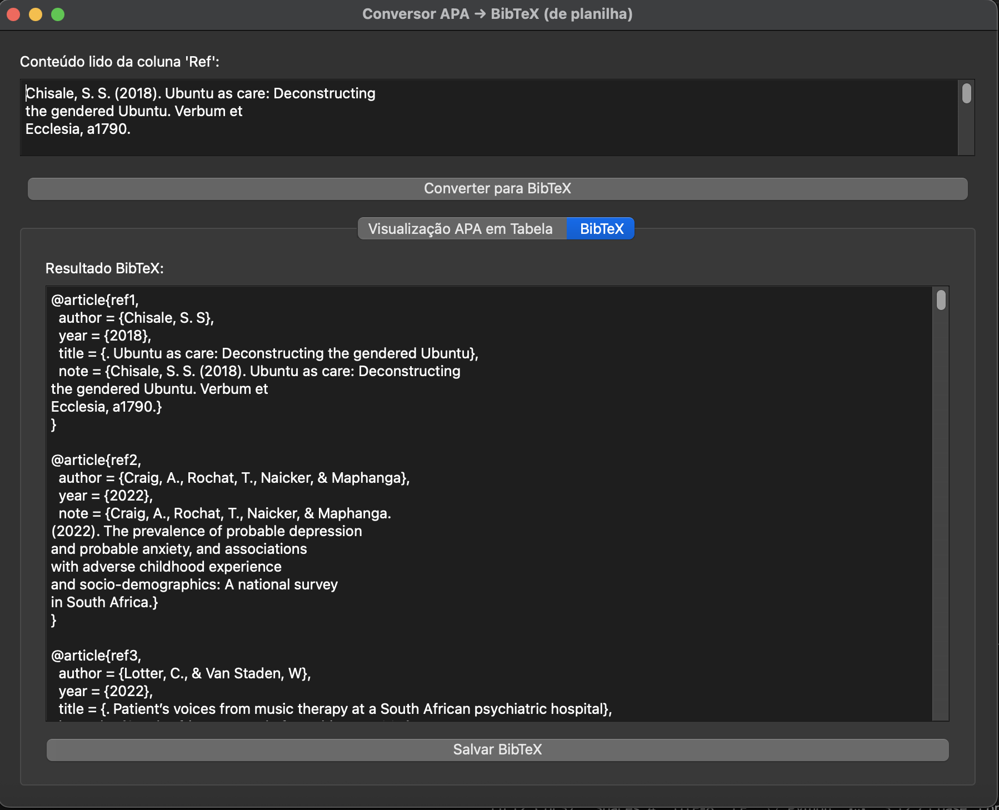
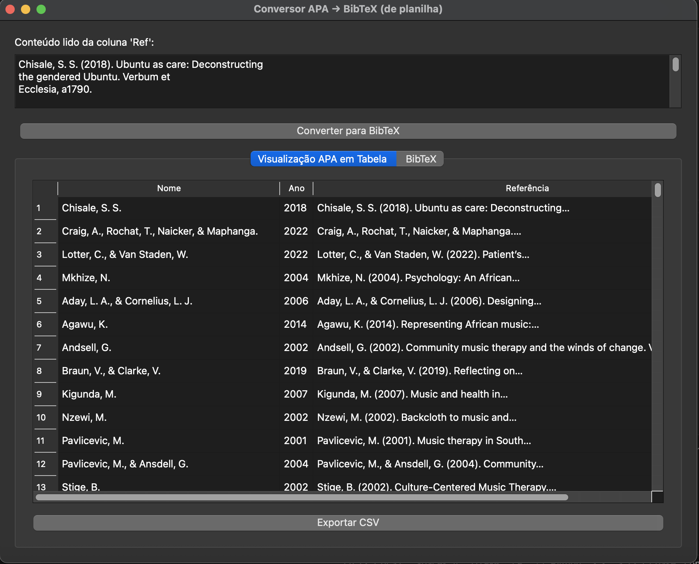

# Conversor APA → BibTeX (de Planilha Excel)

Este aplicativo em Python fornece uma interface gráfica para converter referências bibliográficas no formato APA, extraídas de uma planilha Excel, para o formato BibTeX. Ideal para quem deseja organizar e automatizar a geração de bibliografias acadêmicas.

---

## Funcionalidades

- Importação de referências diretamente de arquivos Excel (`.xlsx` ou `.xls`), buscando a coluna `"Ref"`.
- Exibição das referências em uma tabela organizada por Autor, Ano e Referência completa.
- Conversão automática das referências APA para o formato BibTeX.
- Visualização do resultado BibTeX para cópia ou edição.
- Exportação da tabela APA para CSV.
- Salvamento do resultado BibTeX em arquivo `.bib`.
- Visualização de métricas com gráficos dos autores mais frequentes e distribuição de publicações por ano.

---

## Requisitos

- Python 3.7 ou superior
- Bibliotecas Python:
  - PyQt5
  - pandas
  - matplotlib

Instale as dependências usando:

```bash
pip install PyQt5 pandas matplotlib


```
|  |  |
|---------------------------------------|----------------------------------|


